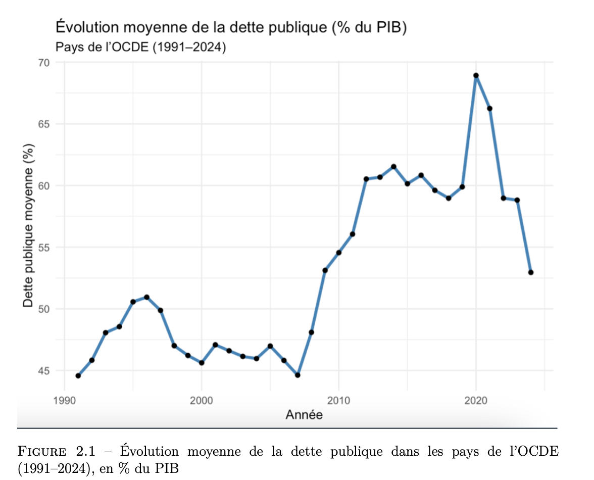
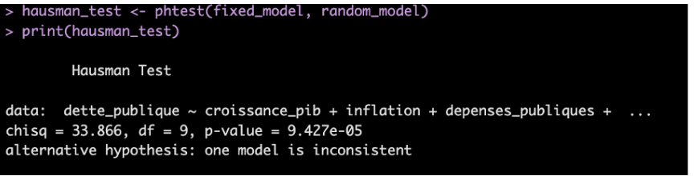

# public-debt-econometrics-r-python
Panel econometrics on OECD public debt (1990–2023) using R. Fixed/Random effects, Hausman, VIF, BP, DW tests.

## Key Results (Selected Outputs)

### Average public debt trend in OECD countries

This figure highlights the long-term increase in average public debt across OECD countries.
A clear structural break is observed after the 2008 financial crisis, followed by a sharp
increase during the COVID-19 period.

### Model selection – Hausman test

The Hausman test strongly rejects the random effects specification (p < 0.001),
indicating that unobserved country-specific effects are correlated with the regressors.
As a result, the fixed effects model is preferred for inference.

### Main Economic Insights
- Public debt increases significantly during major macroeconomic shocks (2008 crisis, COVID-19).
- Higher public expenditure and interest payments are associated with higher debt levels.
- Economic growth tends to reduce public debt ratios in the long run.

# OECD Public Debt — Panel Econometrics (R)

This project is part of an academic research work analyzing the determinants of public debt across OECD countries
using panel econometrics and macroeconomic indicators.

## Objective
Identify the macroeconomic and demographic factors associated with high levels of public debt using panel data models.

## Dataset
- Source: World Bank – World Development Indicators (WDI)
- Countries: 36 OECD members
- Period: 1991–2024
- Observations: 1,224 country-year points
- See `data/DATA_DICTIONARY.md`

## Methodology
Panel econometrics using R:

- Pooled OLS
- Fixed Effects / Random Effects models
- Hausman test
- Breusch–Pagan test (heteroskedasticity)
- Panel serial correlation tests (Durbin-Watson /
   Breusch-Godfrey type)

- VIF (multicollinearity diagnostics)
- Robust standard errors (White)

## Skills Demonstrated
- Panel data econometrics
- Data cleaning and restructuring (wide → long)
- Statistical diagnostics
- Reproducible research structure
- Data storytelling through academic reporting.
## Run
Open R in the project root and run:
source("scripts/main_analysis.R")
